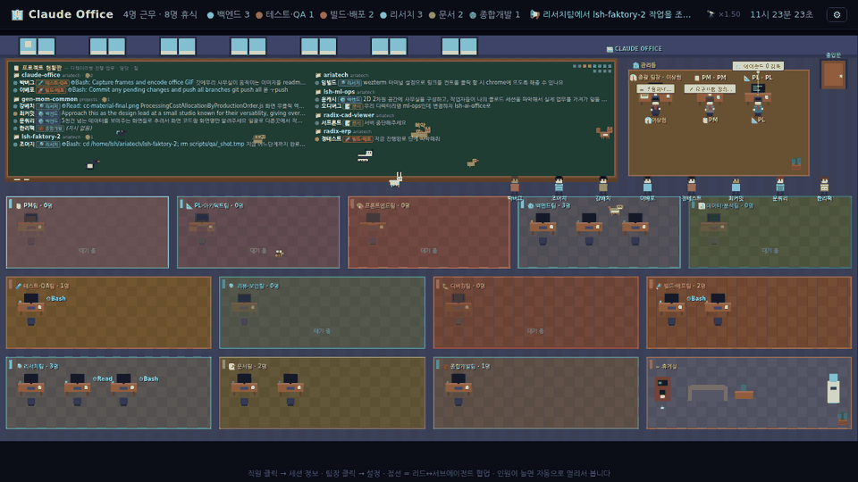

# 🏢 Claude Office

Claude Code 세션들을 **2D 픽셀 사무실**로 보여주는 로컬 대시보드입니다.
세션마다 직원 한 명이 출근해서, 지금 하는 일(파일 편집·Bash·Grep·서브에이전트 …)의 성격에 따라
프론트엔드팀 / 백엔드팀 / 테스트·QA팀 … 방을 옮겨 다닙니다. 서브에이전트는 🤖 인턴으로 투입되고,
상단 칠판에는 **프로젝트 디렉터리별 진행 업무 · 담당자 · 팀 · 현재 도구**가 정리됩니다.



- 외부 라이브러리 없음 — **Python 3.8+ 표준 라이브러리만** 사용, 완전 오프라인(127.0.0.1 전용)
- 클로드 트랜스크립트(`~/.claude/projects/**/*.jsonl`)를 **읽기만** 합니다. 아무것도 수정하지 않습니다.

## 실행

| OS | 방법 |
|---|---|
| Linux / macOS / WSL | `./run.sh` (또는 `python3 server.py`) |
| Windows | `run.bat` 더블클릭 (또는 `python server.py`) |

브라우저에서 **http://localhost:8765** 가 열립니다. 종료는 터미널에서 `Ctrl+C`.

다른 포트: `python3 server.py --port 9000`

## 처음 실행 시 설정 (우상단 ⚙ 또는 총괄 팀장 클릭)

| 항목 | 설명 | 기본값 |
|---|---|---|
| 클로드 세션 디렉터리 | Claude Code가 트랜스크립트를 쌓는 곳. **📂 찾아보기**를 누르면 자동 탐지된 후보(WSL/Windows 홈)가 뜨고 폴더를 골라 넣을 수 있음. `~`·환경변수 사용 가능 | `~/.claude/projects` (Windows: `%USERPROFILE%\.claude\projects`) |
| 총괄 팀장 이름 | 관리동 팀장석에 표시되는 **본인 이름** | 총괄 팀장 |
| PM 이름 / PL 이름 | 관리동 PM석·PL석 캐릭터 이름 | PM / PL |
| 이동 속도 | 직원·관리자 걷는 속도 배율 0.25×~4× (브라우저에만 저장) | 1× |
| 사무실 동물 | 🐾 동물 고르기 팝업에서 30종 중 원하는 동물을 체크하고 종류별 1~5마리 지정 (브라우저에만 저장) | 고양이 1마리 |
| 최대 세션 수 | 최근 활동순으로 몇 개까지 출근시킬지 | 12 |
| 에이전트 활성 기준(초) | 이 시간 안에 활동한 서브에이전트만 표시 | 120 |
| 세션 표시 기간(일) | 이보다 오래된 세션은 퇴근 처리 | 7 |
| 포트 | 변경 시 서버 재시작 필요 | 8765 |

### 세션 디렉터리는 어디? (환경별)

Claude Code를 **어디서 쓰는지**와 서버를 **어디서 띄우는지**에 따라 다릅니다. 같은 환경이면 기본값 그대로면 됩니다.

| Claude Code 실행 환경 | 서버 실행 환경 | 설정에 넣을 경로 |
|---|---|---|
| Windows | Windows `run.bat` | `%USERPROFILE%\.claude\projects` (기본값 OK) |
| WSL | WSL `./run.sh` | `~/.claude/projects` (기본값 OK) |
| WSL | Windows `run.bat` | `\\wsl.localhost\Ubuntu\home\<리눅스계정>\.claude\projects` (배포판 이름은 `wsl -l`, 구버전은 `\\wsl$\Ubuntu\...`) |
| Windows | WSL `./run.sh` | `/mnt/c/Users/<윈도우계정>/.claude/projects` |
| macOS / Linux | 같은 환경 | `~/.claude/projects` (기본값 OK) |

설정은 `server.py` 옆 `config.json`에 저장됩니다 (`config.example.json` 참고). 이 파일을 직접 편집해도 됩니다.
HUD에 **"⚠ 세션 디렉터리를 찾을 수 없어요"** 가 뜨면 경로가 틀린 것입니다.

## 화면 읽는 법

- **칠판 현황판**: `📁 프로젝트` 아래 `● 담당자 [팀] ⚙현재 도구 — 사용자 지시`. 🤖 줄은 그 세션이 띄운 서브에이전트. 내용이 많으면 칠판 안에서 **스크롤**
- **팀 방 13칸**: PM / PL·아키텍트 / 프론트엔드 / 백엔드 / 데이터·분석 / 테스트·QA / 리뷰·보안 / 디버깅 / 빌드·배포 / 리서치 / 문서 / 종합개발 + 휴게실 (줄마다 고르게 배치, 창 너비 100%)
  - 최근 tool 사용 내역(파일 확장자·경로, Bash 명령, 서브에이전트 타입, 스킬)을 가중 투표해서 팀을 정합니다 → 작업이 바뀌면 직원이 걸어서 방을 옮깁니다
- **책상**: LED(🟢 작업 중 / 🟡 최근 / ⚫ 휴식), 프로젝트명, `⚙Bash`·`⚙Edit` 같은 현재 도구
- **연결선**: 점선 = 리드 세션 ↔ 그 세션이 띄운 서브에이전트(팀 색). 메시지를 주고받는 중이면 밝아지며 신호가 흐릅니다. 금색 실선 = 한 세션에서 분기된 세션끼리
- **관리동(총괄 팀장·PM·PL)**: 칠판 옆. 사무실이 돌아가면 같이 타이핑하고(팀장 모니터엔 근무/검토/휴식/에이전트 막대 대시보드), 가끔 현황판을 점검하거나 직원 자리를 돌아봅니다 — 팀장은 바쁜 직원, PM은 리드 세션, PL은 서브에이전트를 찾아갑니다
- **텍스트 겹침 방지**: 말풍선·이름표·라벨이 같은 높이에서 겹치면 자동으로 위/아래로 비켜나고, 밀려난 말풍선은 화자까지 연결선이 그어집니다
- **자동 줌**: 인원이 늘어 방이 커지면 카메라가 물러나서 **항상 한 화면(스크롤 없음)**. 가로는 창 너비 100%
- 직원 클릭 → 세션 상세(지시 전문, 브랜치, 서브에이전트). 팀장 클릭 → 설정

## 팀 판정 규칙 바꾸기

`server.py` 상단의 표만 고치면 됩니다.

- `AGENT_TYPE_TEAM` — 서브에이전트 타입 → 팀
- `NAME_KEYWORDS` — 에이전트 이름/설명 키워드 → 팀
- `_classify_path()` — 파일 확장자·디렉터리 → 팀
- `_classify_command()` — Bash 명령 → 팀
- `TEAMS` — 팀 목록 자체(추가/삭제 가능, 클라이언트는 자동 반영)

## 파일

```
server.py            서버 + 세션/에이전트 분석 (표준 라이브러리만)
index.html           사무실 화면 (Canvas + 약간의 HTML)
config.example.json  설정 예시 → 저장 시 config.json 생성
run.sh / run.bat     실행 스크립트
```

## 문제 해결

- **직원이 아무도 없다**: 세션 디렉터리 경로 확인. 5KB 미만이거나 표시 기간(일)보다 오래된 세션은 제외됩니다
- **포트가 이미 사용 중**: `python3 server.py --port 9000`
- **서브에이전트가 안 보인다**: 서브에이전트는 `<세션디렉터리>/<프로젝트>/<세션id>/subagents/` 에 기록될 때만 인식됩니다 (Claude Code 2.1+). 활성 기준(초)을 늘려 보세요
